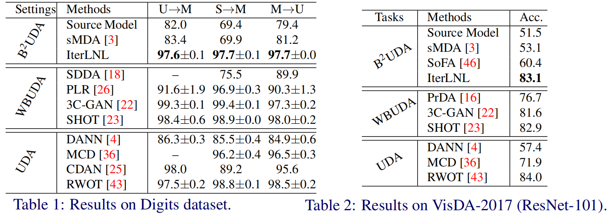
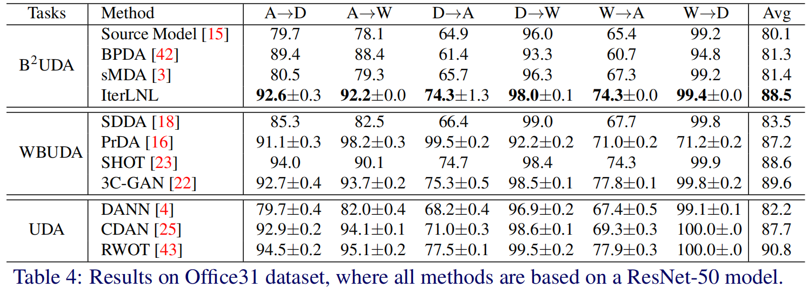

# Unsupervised Domain Adaptation of Black-Box Source Models

## Introduction
This is the official code of paper ["Unsupervised Domain Adaptation of Black-Box Source Models"](https://arxiv.org/abs/2101.02839) (BMVC 2021).


## Results
**Digits and VisDA-2017**


**Office31**



## Prepare Environment

The requirement of some main packages are:
```python
torch==1.6.0
torchvision==0.7.0
gorilla-core==0.2.7.3
gorilla2d==0.2.8.7
```
Note that `gorilla-core` and `gorilla2d` are codebases developed by [Gorilla-Lab-SCUT](https://github.com/Gorilla-Lab-SCUT), and it is welcome to use them and give us some advices.

**It is recommended to use docker image built by mine:**

`docker pull zhjscut/gorilla:core0.2.7.3_2d0.2.8.7`


## Usage

At first clone this repository:
```sh
git clone git@github.com:zhjscut/IterLNL.git
```
Then run a docker image (it may need some soft link to map one's dataset directory to `/data`):
```sh
docker run --privileged --network host --name IterLNL \
-v directory_of_cloned_code:/IterLNL \
-v /your_dataset_directory:/data \
--shm-size=2g -w /IterLNL -it cuda101-pt160-gorilla:core0.2.7.3_2d0.2.8.7 /bin/bash
```
After than we can start to run the experiments~

All commands of our experiments on a certain dataset are written in `dataset_name.sh`, such as `office31.sh`.

**Running Experiments**

At first train a model on source domain as the black box model:
```
CUDA_VISIBLE_DEVICES=0 python main.py configs/pretrain/office31.yaml --source A --target W --lr 0.0005
```
if one receive `RuntimeError: Source model is trained, please run the IterLNL experiment next`, it means black box model is trained.

**NOTE**: then one should modify `source_models` in solver file, for example, `solver/solver_iterlnl.py`, replacing the value of key `Office31_A2W` in `source_models` as the newly-trained model path.

Next running IterLNL:
```
CUDA_VISIBLE_DEVICES=0 python main.py configs/train/office31.yaml --source A --target W --lr 0.003 --max_epochs 30
```

We don't provide the checkpoints since the training of each model is quick and there are too many tasks.


## Contributing
Any pull requests or issues are welcome.


## Citation

If you use this benchmark in your research, please cite this project:

```latex
@article{zhang2021unsupervised,
  title={Unsupervised Domain Adaptation of Black-Box Source Models},
  author={Zhang, Haojian and Zhang, Yabin and Jia, Kui and Zhang, Lei},
  journal={arXiv preprint arXiv:2101.02839},
  year={2021}
}
```
